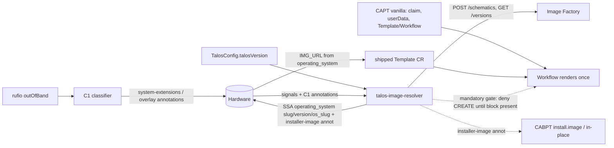

# Migration — Consolidating the Talos + Tinkerbell Glue into a Runtime-Extensions Provider

Status: Proposed — 2026-09-05

## Revision — 2026-09-05 adversarial review applied

A 3-lens adversarial review (CAPI-mechanism correctness, completeness vs CAREN + the repo's C0–C5
design, live-cluster migration safety), verified against the code, corrected three live-cluster
blockers: the Workflow-CREATE ordering gate is now **mandatory and enabled early** (§3.7, §2.2), not
demoted to ecosystem-compat — it is the sole mechanism that stops an empty-`operating_system` render
from bricking a machine permanently; Wave 1 **must not repoint the control plane's
`TinkerbellMachineTemplate`** (§3.6, SP-4), because CAPT's immutability webhook refuses the
inline→`templateRef` swap and a template rotation rolls the fragile 2-member etcd; and the
terraform→topology handoff goes through `terraform state rm`, **never** a config-removal delete
(§4.2, §7.2), which would trigger CACPPT's finalizer teardown of the control plane. It also replaced
one unsatisfiable migration gate (§7.1 cross-Hardware value equality → canary correctness gate) and
reframed the installer-image path to **Strategy B** (per-machine via a Hardware annotation), since
adopted as the decided design over the now-rejected Strategy A (§4.5, SP-7). This hardens — it does not change — the "supersedes architecture.md"
framing below.

This document is the binding successor to [architecture.md](architecture.md). Where that
document froze a deliberately no-ClusterClass design — machine deletion-phase hooks, plain
controllers, and admission webhooks, because lifecycle and topology hooks *could never fire* in the
terraform-created cluster — this one records the platform decision to reverse that constraint:
adopt ClusterClass, migrate the cluster to `spec.topology`, and consolidate all Talos + Tinkerbell
"glue" out of the three forked CAPI providers into a single CAREN-aligned runtime-extensions
provider. It inherits architecture.md's governing facts (F1–F10), preconditions (P1–P8), ownership
matrix, and naming standard, and it inherits [caren-analysis.md](caren-analysis.md) as the verified
blueprint for the runtime-extension shape. It supersedes architecture.md's "no lifecycle/topology
hooks, ever" thesis (F1) and its Future-work "ClusterClass adoption path" — that future is now the
plan.

The design keeps the rigor architecture.md set: every decision carries its "why", every contested
field names exactly one writer, and every code reference is concrete. Nothing here is a placeholder.

## 1. Goal and the fixed decisions

**Goal.** Produce one deployable runtime-extensions provider that owns every Talos-on-Tinkerbell
integration concern that does not intrinsically belong to a provider's own reconcile loop, so that:

- CAPT (`cluster-api-provider-tinkerbell`) carries **zero Talos code**, remaining a maintained thin
  *generic* fork of upstreamable features (not literal vanilla-upstream — §5.1).
- CABPT (`cluster-api-bootstrap-provider-talos`) keeps only the Talos **in-place execution** and
  config-render seam, and sheds its last infrastructure-provider coupling.
- CACPPT (`cluster-api-control-plane-provider-talos`) keeps only the control-plane in-place **owner**
  half and the `TalosControlPlaneTemplate` CRD (which *is* the ClusterClass asset).
- The runtime extension owns image-identity resolution, Hardware attribute management, the shipped
  Workflow Template, the ClusterClass flavor + variable schema + `GeneratePatches` mutators, the
  cluster lifecycle hooks, and the existing plain-controller components (classifier, teardown,
  janitor).

**Fixed user decisions** (treated as constraints throughout, not re-litigated):

1. **Target is CAREN-proper plus ClusterClass.** The cluster migrates to `spec.topology`; the
   providers gain ClusterClass support (`TalosControlPlaneTemplate`, `TalosConfigTemplate`, and a
   new `TinkerbellClusterTemplate`).
2. **In-place UPDATE execution stays in CABPT.** The in-place runtime-extension server
   (`internal/inplace/*`, `CanUpdateMachine`/`CanUpdateMachineSet`/`UpdateMachine`), the config-render
   seam, and the control-plane owner half in CACPPT are *not* moved out of tree. This design must
   never register an in-place hook.
3. **The Tinkerbell Workflow Template moves out of terraform** and ships from the runtime extension
   via `runtime-extensions-components.yaml`.
4. **The runtime extension manages the Hardware attributes** the Template consumes to build the image
   URL. Provisioning image is delivered through Hardware metadata, never through
   `TinkerbellMachine.status`. Because vanilla CAPT creates the Workflow at claim with no
   `operating_system` awareness and tink-controller renders it exactly once, this delivery is only
   *safe* when a mandatory Workflow-CREATE admission gate holds the render until the resolver has
   written `operating_system.slug` (§3.7, §2.2) — that gate is what makes Hardware-metadata delivery
   correct, and it is load-bearing, not ecosystem-compat.

## 2. Target architecture: one runtime-extensions binary

### 2.1 Two deployables, not one and not six

The consolidation replaces architecture.md's six-binary roster with **two** deployables in one
renamed repository (`cluster-api-runtime-extensions-tinkerbell`):

- **`cmd/runtime-extensions`** — the CAREN analog and the subject of this document. One
  `ctrl.Manager` whose `Options.WebhookServer` *is* the CAPI runtime server
  (`common/pkg/server.NewWebhookServer` wrapping `exp/runtime/server.Server`, which embeds
  controller-runtime's `webhook.Server`; caren-analysis.md §3 "the runtime server IS the webhook
  server"). One process, one listener (`:9443`), one cert. It serves the `DiscoverVariables` /
  `GeneratePatches` topology hooks, the cluster lifecycle hooks (into which C5 folds), any admission
  webhooks (the resolver's mandatory, default-on Workflow-CREATE validator — load-bearing for install
  correctness, §3.7), and the plain controllers C1
  (classifier), the resolver (ex-C2 + externalized CAPT engine), C3 (teardown), C4 (janitor).
- **`cmd/bmc-discovery`** — the existing mDNS BMC discovery controller (C0), kept a **separate
  Deployment** with its own image, but **bundled into the same chart and the same
  `runtime-extensions-components.yaml`** (one repo, one release train — see §2.7). Its `hostNetwork` /
  Multus `net1` posture and `Recreate` strategy are structurally incompatible with a webhook-serving,
  replica-scaled *pod* whose cert SANs must resolve through a stable Service (architecture.md
  "Deployment topology" already forbids coupling mDNS serving to webhook serving). It serves no
  runtime hook, so it belongs outside the runtime-server *process* — same repo, same modules, same
  release, different binary and pod.

> **Decision — carve discovery out at the pod, unify it at the release.** Folding discovery into the
> webhook-serving *pod* would break stable-Service cert SANs and replica scaling, so it stays a
> distinct Deployment with its own posture. It is **not** a separate release: the discovery
> Deployment ships as a plain workload inside the single `runtime-extensions-components.yaml`
> alongside the runtime-extensions Deployment (one `clusterctl`/`helm install` installs both). The
> pod-level carve-out is load-bearing; the packaging is deliberately unified.

### 2.2 The hooks, webhooks, and controllers the runtime extension owns

| Concern | Kind | Gated by | Needs ClusterClass |
| --- | --- | --- | --- |
| `DiscoverVariables`, `GeneratePatches` (incl. `install.image` injection, `controlPlaneEndpoint`) | Runtime (topology) hook | core gates `ClusterTopology` + `RuntimeSDK` | Yes |
| `BeforeClusterUpgrade`, `AfterControlPlaneUpgrade`, `BeforeClusterDelete` (C5 folds here) | Runtime (lifecycle) hook | core gates `ClusterTopology` + `RuntimeSDK` | Yes |
| Workflow-CREATE validator — **mandatory, load-bearing for install correctness** (denies Workflow CREATE until `operating_system.slug` is present/current) | Admission webhook | default-on, `failurePolicy: Fail`, CAPT `objectSelector` | No |
| Image-identity resolver (schematic + version + Hardware OS metadata + installer-image) | Plain controller | leader | No |
| `talos-hardware-classifier` (C1) | Plain controller | leader | No |
| `talos-machine-teardown` (C3) — `pre-terminate` deletion-phase hook | Plain controller | leader | No |
| `tinkerbell-hardware-janitor` (C4) | Plain controller | leader | No |

> **Runtime prerequisite for the topology/lifecycle rows.** External `DiscoverVariables` /
> `GeneratePatches` and lifecycle hooks require the CAPI **core** manager to run **both**
> `ClusterTopology=true` **and** `RuntimeSDK=true` — not merely "the topology controller"; without
> `RuntimeSDK` the external hooks are inert. `RuntimeSDK` is already enabled because the in-place hooks
> depend on it, so the incremental prerequisite is only `ClusterTopology`, but the dependency is dual.

### 2.3 The ownership split with the three providers

| Concern | Owned / served by | Location |
| --- | --- | --- |
| Topology mutation (`DiscoverVariables`/`GeneratePatches`), incl. `machine.install.image` | **runtime extension** | `pkg/handlers/talos/mutation` |
| Cluster lifecycle hooks (C5 manifest sync) | **runtime extension** | `pkg/handlers/lifecycle` |
| ClusterClass + flavor templates + `ExtensionConfig` + Workflow `Template` CR | **runtime extension** | shipped in `runtime-extensions-components.yaml` |
| Per-Hardware schematic/version resolution + Hardware OS metadata | **runtime extension** | `internal/resolve` |
| Classification, teardown, janitor, discovery | **runtime extension** (+ separate discovery binary) | `internal/{classifier,teardown,janitor,discovery}` |
| `CanUpdateMachine` / `CanUpdateMachineSet` / `UpdateMachine` (in-place executor) | **CABPT** | `internal/inplace/server.go` (unchanged) |
| Config render, webhook immutability bypass, in-place config hash | **CABPT** | `controllers/*`, `api/v1beta1/{inplace,talosconfig_webhook}.go` (only `installer_image.go` retired) |
| Control-plane in-place **owner** half (candidate select, etcd gate, trigger) | **CACPPT** | `controllers/inplace*.go` (unchanged) |
| Worker in-place owner half | **core CAPI `MachineSet`** | no fork |
| Infrastructure provisioning: claim, `userData`, Template/Workflow creation, provisioned short-circuit | **CAPT (vanilla)** | `controller/machine/*` (Talos code removed) |

### 2.4 The one hard invariant, and HA under `failurePolicy: Fail`

Because this binary shares CAREN's one-process pattern, it could trivially register an in-place hook
by mistake. **It must register zero `runtimehooksv1` in-place hooks.** Core CAPI hard-fails a second
`UpdateMachine` registration and would break in-place updates for the entire management cluster
(architecture.md F3; CACPPT enforces the single-extension rule at `inplace.go:189-192`). A
build/registration guard asserting the runtime server exposes none of the three in-place hooks is
mandatory, not optional.

Replica scaling is correct because controller-runtime registers the `WebhookServer` as a
**non-leader-election runnable** while all `internal/*` controllers are leader-election runnables.
With `replicas: 2` and `--leader-elect=true`, *every* replica answers admission and runtime-hook
requests (HA against `failurePolicy: Fail`), but the reconcilers run only on the leader. This is the
single-cert HA posture CAREN gestures at but never implements (it runs one replica). The constraint:
no controller on the webhook path may cache a decision in memory and assume single-instance
ownership — C3's credential cache is already a Secret, not memory, and every other decision is
recomputed from the API server. Leader-election ID:
`cluster-api-runtime-extensions-tinkerbell.tinkerbell.org`.

### 2.5 Module layout — three modules, adapted from CAREN

The two forces CAREN's `root / api / common` split solves are both real here: (a) ClusterClass
authors and the fork providers must import the variable/config **types** without dragging
controller-runtime, Talos machinery, or the mutation engine; (b) `GeneratePatches` needs typed access
to fork template CRDs whose modules pin conflicting `cluster-api` / `controller-runtime` versions, so
those APIs are rsync-vendored, not `require`d.

```text
cluster-api-runtime-extensions-tinkerbell/
  go.work                         # dev-only: root + api + common
  metadata.yaml                   # clusterctl releaseSeries -> CAPI contract (derived, not literal)
  cmd/
    runtime-extensions/main.go    # the consolidated manager (guarded: zero in-place hooks)
    bmc-discovery/main.go         # ex cmd/main.go (separate deployable)
  api/                            # MODULE 2: schema-only CRDs + vendored fork APIs
    v1alpha1/                     # TalosClusterConfig, TalosWorkerNodeConfig (never installed)
    external/                     # rsync-vendored: talosbootstrap/, taloscontrolplane/, tinkerbellinfra/
  common/                         # MODULE 3: reusable topology-mutation library (CAREN port)
    pkg/capi/clustertopology/{variables,patches,handlers/mutation}
    pkg/server/                   # runtime+webhook server wrapper
    pkg/testutils/capitest/       # table-driven GeneratePatches fixtures
  internal/                       # root module, process-private
    discovery/  classifier/  resolve/  teardown/  janitor/  logging/
  pkg/handlers/
    talos/mutation/   generic/mutation/   lifecycle/
  charts/
    cluster-api-runtime-extensions-tinkerbell/   # provider chart (handlers + ExtensionConfig +
                                                 # Workflow Template + optional ClusterClass)
    tinkerbell-bmc-discovery-controller/         # discovery chart (separate)
  hack/third-party/               # throwaway modules pinning fork tags for `make apis.sync`
```

- **`api/`** holds the kubebuilder-marked variable roots whose generated CRD YAML is `go:embed`-ded
  and fed to `SchemaFromCRDYAML` at init but **never installed** (caren-analysis.md §2 "schema-only
  CRDs"); CEL `XValidations` come free from core CAPI. `api/external/*` is rsync-vendored fork API
  (via `make apis.sync`, excluding `*_webhook.go`/`*_test.go`, import paths sed-rewritten). CAPT
  already ships a standalone `api/go.mod`; CABPT and CACPPT are single-module repos, so vendoring is
  the only way to get `TalosConfigTemplate` / `TalosControlPlaneTemplate` types into one binary
  without a controller-runtime pin collision.
- **`common/`** is the mutation engine (the ordered `MetaMutator` walk, `MutateIfApplicable`, the
  dual-contract holder-ref matcher, the server wrapper). It depends on `cluster-api` +
  `controller-runtime` but **not** on the root module, so the forks could reuse its matchers.
- **Root** wires `cmd/`, `internal/`, `pkg/handlers/`; it `require`s `api` and `common` at pinned
  versions, with `go.work` supplying live replacements in dev.

> **Decision — collapse the C1-era resolver split.** architecture.md modeled three cooperating
> objects: C1 writes extension inputs, CAPT resolves the schematic into `TinkerbellMachine.status`,
> and C2 mirrors that trio into Hardware OS metadata. This design collapses CAPT's resolver and C2's
> mirror into **one** component (`internal/resolve`, provisional name `talos-image-resolver`) that
> resolves *and* writes. There is no longer a `status` trio to mirror, so the mirror/resolver race
> and the `diskImageURL`-vs-`dhcp.arch` arbitration disappear entirely (see §3.2). C1 stays a
> separate plain controller because its trigger (rufio out-of-band inventory, 24h best-effort,
> BMC-dependent) and failure domain differ from a Factory-facing resolver.

### 2.6 RBAC and field-manager identity

One ServiceAccount + one ClusterRole for the manager, the least-privilege **union** of the folded
components' grants. Do **not** inherit CAREN's wildcard-over-all-provider-groups ClusterRole
(caren-analysis.md §5 "do not copy") — that shape exists only for its `namespacesync` feature, which
this repo does not have. Discovery keeps its existing namespace-scoped Role.

Merging six binaries into one process does **not** collapse the ownership matrix. Each controller
keeps passing its own SSA field-manager string (`talos-hardware-classifier`, `talos-image-resolver`,
`talos-machine-teardown`, `tinkerbell-hardware-janitor`, C5's foreign `talos`) and its
`<function>.tinkerbell.org` annotation domain. A field manager is a string, not a process; keeping
them distinct preserves the one-writer-per-field contract and makes a future re-split non-breaking.

### 2.7 Release plumbing (why it is CAREN-shaped)

The chart is rendered by `helm template` into a **single** `runtime-extensions-components.yaml`, and a
`metadata.yaml` with a `releaseSeries` (contract per minor) makes `clusterctl` treat this as a
`RuntimeExtensionProvider`. `helm install` and `clusterctl init --runtime-extension` therefore
deploy identical manifests. Two goreleaser builds (`runtime-extensions`, `bmc-discovery`, binary
`manager` for the shared Dockerfile) plus a release hook that renders the components file.

That one components file carries **both** Deployments: the runtime-extensions Deployment with its
`ExtensionConfig`, `ValidatingWebhookConfiguration`, Services, and cert wiring, and the bmc-discovery
Deployment as a plain `hostNetwork` workload with none of that (no Service, no cert, no runtime
registration). Bundling is purely packaging — the two remain independent pods with independent
scaling and failure domains — so a `clusterctl init --runtime-extension` (or one `helm install`)
brings up the whole glue layer in a single step, while the pod-level separation of §2.1 is preserved.

The `ExtensionConfig` is a **static helm-templated manifest** carrying
`runtime.cluster.x-k8s.io/inject-ca-from-secret` — no self-registration Runnable, no registry-warmup
machinery, because Helm templates the namespace at install time and CAPI's native annotation supplies
the caBundle from the cert-manager Secret (caren-analysis.md §3). One cert-manager `Certificate`
(`<fullname>-serving-cert`) carries SANs for both Services (`-runtimehooks`, `-admission`); the
admission `ValidatingWebhookConfiguration` uses `cert-manager.io/inject-ca-from` on the same Secret.

> **Decision — derive the contract from `go.mod`, not a literal.** CAREN's documented bug stamps
> `metadata.yaml`'s `contract` as a string constant. Derive it from
> `go list -m sigs.k8s.io/cluster-api` in CI so `clusterctl` never mis-judges compatibility across a
> CAPI contract bump. Gate releases on a `go work sync` / no-leaked-`replace` check so a broken
> module graph never ships to `go get` consumers.

## 3. Provisioning and image delivery via Hardware attributes

This section is the detailed sub-project for the **provisioning-image rendezvous**: it extracts
CAPT's Image-Factory schematic/version engine into the runtime extension, extends it to produce a
*bootable* raw-disk schematic, and writes `spec.metadata.instance.operating_system` onto claimed
Hardware — replacing terraform's static bake-in and CAPT's `status` trio.

### 3.1 What moves, and from where

| Logic | Current home | New home |
| --- | --- | --- |
| Schematic build (dedupe/sort, NVMe rule), Factory registration, version resolution | CAPT `pkg/schematic/{schematic,registry,versions}.go` | `internal/resolve` |
| Version policy (full pin / minor-track / contract-pin) | CAPT `controller/machine/schematic.go` (`resolveTalosVersion`, `contractMinor`, `specTalosVersion`) | `internal/resolve/version_policy.go` |
| Kernel args / overlay / bootloader (the bootable-image half, P2) | terraform `modules/data-lookup/modules/images/main.tf` | `internal/resolve` (folded into `Customization`) |
| Writing image identity onto `Hardware.operating_system` | terraform `modules/…/hardware/main.tf` (static) | `internal/resolve` (dynamic, SSA) |
| Mirroring the `status` trio → `operating_system` | C2 `talos-os-metadata` (mirror-only) | **superseded** — the resolver is the writer |

The engine is cleanly externalizable exactly as prior analysis established: it reads Hardware +
the bootstrap `TalosConfig.spec.talosVersion` (unstructured) + annotations, imports no CAPT
controller internals, and `pkg/schematic` pulls no new deps (only `tinkv1` + `sigs.k8s.io/yaml`).

### 3.2 The two-resolver problem — extraction alone is insufficient

Two schematic engines exist in production today and they are **not** equivalent:

1. **terraform's images module** registers schematics whose `customization` carries `systemExtensions`
   **plus** `extraKernelArgs` (`console=tty0`, `console=ttyAMA0,115200`, `net.ifnames=0`, and
   critically `talos.config=http://<tinkerbell-ip>:7080/2009-04-04/user-data`), **plus** arm64
   `bootloader: sd-boot`, **plus** rpi `overlay`. Its schematic ID becomes `operating_system.slug`,
   which the **live install Template consumes**. The `talos.config` kernel arg is what makes the
   raw-disk image fetch its config from tootles; without it the node boots into maintenance mode and
   provisioning hangs (architecture.md P2).
2. **CAPT `pkg/schematic`** deliberately models **only** `systemExtensions` — its own comment notes
   the Factory ignores `extraKernelArgs`/`meta` for the *installer* and *initramfs* images. That is
   true for the installer artifact but **false for the raw disk image**, which honors kernel
   args/overlay/bootloader. This is precisely why CAPT's `status.diskImageURL` was never wired into
   the live Template and terraform's schematic ID is still the one on the wire.

> **Decision — the resolver folds in the P2 inputs; one schematic backs both artifacts.** Simply
> lifting `pkg/schematic` and pointing the Template at its output would produce an **unbootable**
> image. `Customization` grows `ExtraKernelArgs []string`, `Overlay *Overlay`, `Bootloader string`
> alongside `SystemExtensions`. `talos.config=…` is assembled from a required deploy-level flag
> (`--tootles-url` / `--tinkerbell-ip`, matching `images/main.tf:15`); the console/`net.ifnames`
> args are constants; arm64 implies `bootloader: sd-boot`; `overlay` comes from C1's
> `talos.tinkerbell.org/overlay` annotation. Because the Factory ignores those extra fields when it
> builds the `metal-installer` image, a single content-addressed ID that *includes* them yields both
> (a) a bootable raw image with `talos.config` baked in and (b) a correct installer image. This
> preserves the "compute once, install and upgrade agree" property while fixing provisioning. The
> Factory behavior is flagged explicitly so no future reader "optimizes" the kernel args back out.

This is the single most dangerous divergence from CAPT's `systemExtensions`-only engine, and it must
be caught before the Template points at resolver output.

### 3.3 Where the resolver writes: exact field map

Write target: `Hardware.spec.metadata.instance.operating_system` (type
`MetadataInstanceOperatingSystem`). The resolver writes the **whole block atomically** — all keys or
none — matching the live shape terraform emits.

| `operating_system` field | Value | Derivation | Consumed by |
| --- | --- | --- | --- |
| `slug` | schematic ID (content-addressed, registered) | `Registrar.Register(Build(signals))` | Template `image/{Slug}/…` |
| `version` | `v1.13.9` (full, `v`-prefixed) | `resolveTalosVersion` (§3.4) | Template `…/{Version}/…` |
| `os_slug` | **`talos-<version>-<arch>`** e.g. `talos-v1.13.9-amd64` | `fmt.Sprintf("talos-%s-%s", version, arch)` | Template `metal-{OsSlug \| splitList "-" \| last}` → arch |
| `image_tag` | `v1.13.9` (== version) | same as `version` | tootles EC2 metadata |
| `distro` | `talos` (constant) | constant | tootles EC2 metadata |

> **Decision — emit the dash form, never the underscore form.** The authoritative live block
> (`images/locals.tf:43`) is `os_slug = "talos-${talos_version}-${arch}"`, i.e. `talos-v1.13.9-amd64`.
> The underscore fallback in `hardware/main.tf:36` (`join("_", …)` → `talos_v1_13_9`) is dead — it
> fires only when `var.operating_system == null`, which production never passes — and if it ever
> fired it would double-break the Template: it omits `slug` (`image//…`) and, having no dashes,
> `splitList "-" | last` returns the whole string (`metal-talos_v1_13_9.raw.zst`) instead of an arch.
> The resolver must emit the dash form and a golden test must assert the underscore form is never
> produced. Arch extraction is verified: `talos-v1.14.0-rc.1-amd64 | splitList "-" | last` = `amd64`
> (arch is always the final segment even with internal dashes). The resolver's `arch` and the
> `os_slug` arch are the same `architectureOf(hw)` value, so they cannot disagree.

**Second output — the installer reference (upgrade rendezvous).** Because CAPT's `status.installerImage`
disappears with the fork, the resolver publishes
`talos.tinkerbell.org/installer-image = factory.talos.dev/metal-installer/<id>:<version>` on the
Hardware (resolver-owned annotation). Its obligation ends at *publishing* the reference; the
*consumer* is the ClusterClass path (§4.5) with the Hardware annotation retained as the Strategy-B
escape hatch and a diagnostic.

### 3.4 Inputs (the C1 → resolver contract) and version policy

`Signals` (ported from `schematic.go`) grows to carry the P2 inputs: `Architecture`, `DiskDevices`
(NVMe rule), `ExtraExtensions` (union of Hardware + TinkerbellMachine `system-extensions`
annotations), `ExtraKernelArgs` (console/`net.ifnames` constants + `talos.config` + C1's
`extra-kernel-args`), `Overlay` (C1's `overlay` annotation), `Bootloader` (`sd-boot` when arm64). C1
remains the **exclusive** writer on Hardware of `system-extensions`, `overlay`, and
`extra-kernel-args`; these are the resolver's inputs. The NVMe built-in (`siderolabs/nvme-cli`) stays
a resolver built-in read from `Hardware.spec.disks` (C1 deliberately does not duplicate it).

Version policy ports 1:1 from `controller/machine/schematic.go`; only the annotation carrier changes:

- **Full pin** (`v1.13.9`): used exactly, never bumped.
- **Bare minor** (`v1.13`): `LatestPatch` → newest GA patch; the minor stays fixed.
- **Unset / `latest`**: `contractMinor` pins the newest GA minor on **first resolution of an
  unprovisioned machine**, stamped as `talos.tinkerbell.org/contract`; thereafter tracks that minor's
  latest patch. A provisioned machine with no pin is left unresolved (returns `""`) so the resolver
  can never ask CABPT to skip a minor (Talos forbids it).
- **Empty result ⇒ write nothing.** Never guess an OS version. `VersionResolver` keeps its 10-minute
  TTL cache, single-flight lock, GA-only parse, and stale-on-error fallback, so a steady-state
  reconcile makes no Factory calls.

The bootstrap `TalosConfig` is read via `Machine.spec.bootstrap.configRef` as unstructured (no
`sigs.k8s.io/cluster-api` import). **RBAC must grant `get talosconfigs.bootstrap.cluster.x-k8s.io`** —
omitting it reproduces the exact `Forbidden`-silently-skips-resolution bug that disabled CAPT
resolution fleet-wide for the life of the feature (architecture.md P3).

### 3.5 SSA discipline, triggers, and the provisioned-freeze guarantee

The resolver is the **sole writer** of `operating_system` on **claimed** Hardware, field manager
`talos-image-resolver`, following the repo's SSA discipline (architecture.md ownership matrix):

- **Sparse apply**: an `unstructured.Unstructured` carrying only identity + the
  `spec.metadata.instance.operating_system` path — never a typed `Hardware` apply (that would
  co-assert zero-valued `instance.id`/`hostname` owned by C0/terraform). `client.Apply` with
  `FieldOwner("talos-image-resolver")`, `ForceOwnership`, and the read `resourceVersion` as an
  optimistic precondition (atomic against the release race). The resolver additionally owns the
  `talos.tinkerbell.org/contract` and `talos.tinkerbell.org/installer-image` annotations (granular
  map keys). It **never asserts** `spec.userData` (CAPT), `spec.disks`/`instance.id`/`instance.hostname`
  (C0/terraform), or the C1 annotations it reads.
- **Primary reconcile: `TinkerbellMachine`** (the concrete `talosVersion` is reached through it and
  it fires on claim), with `Watches` on Hardware (keyed on CAPT's claim labels) and on the bootstrap
  `TalosConfig` (unstructured) so annotation changes, re-classification, terraform re-applies, and
  version bumps all retrigger.
- **Claimed-Hardware predicate (load-bearing):** verify owner labels
  `ownerName == machine.Name ∧ ownerNamespace == machine.Namespace`. Not claimed ⇒ stop. The
  resolver **never** writes released or unclaimed Hardware — that state is C4's clear and terraform's
  bootstrap-node authorship.
- **Provisioned-freeze split (the no-re-image guarantee):** if the Hardware carries
  `v1alpha1.tinkerbell.org/provisioned`, do **not** recompute `operating_system` (leave the
  provisioning-time value) — but still refresh the `installer-image` annotation so the upgrade path
  stays current (P3 parity). Unprovisioned: register schematic, compute the block, SSA-apply
  atomically.

Three independent reasons make re-imaging impossible, all of which must hold: (1) **Workflows render
exactly once** at tink-controller's first reconcile (`status.state == ""`) — changing Hardware
metadata after the Workflow exists does not re-render it; (2) **provisioned-freeze** means the value
does not even change post-provision; (3) **the upgrade path is separate** (in-place OS upgrades are
driven by `TalosConfig.talosVersion` → installer image → CABPT — a patch bump upgrades in place, it
never rewrites the disk). This preserves architecture.md's ground-truth invariant "CAPT never
re-images" while keeping the P3 upgrade currency the fork worked to fix.

### 3.6 Shipping and consuming the Workflow Template

`template-data.yaml` moves out of terraform and ships as a `tinkerbell.org/v1alpha1` `Template` CR
(`spec.data *string`) inside `runtime-extensions-components.yaml`, rendered by the provider chart.
Its body is unchanged — `IMG_URL` already builds entirely from
`.Hardware.Metadata.Instance.OperatingSystem.{Slug,Version,OsSlug}` and never needs CAPT `status`:

```text
IMG_URL   = https://factory.talos.dev/image/{Slug}/{Version}/metal-{OsSlug | splitList "-" | last}.raw.zst
DEST_DISK = {index .Hardware.Disks 0}
```

Because the Template hardcodes `.raw.zst` and reconstructs the URL from three scalar fields, the
resolver never emits a full URL or a compression suffix — the cleanest resolution of architecture.md
P7 on the Hardware-metadata path: `status.diskImageURL`'s `.raw.xz` is simply not on this wire.

**Ordering hazard — an empty `operating_system` renders a broken URL.** Because the three scalars are
substituted verbatim, a Workflow that renders before the resolver has written the block produces
`IMG_URL = https://factory.talos.dev/image///metal-.raw.zst`, `image2disk` 404s, and render-once makes
it a **permanent brick**. The mandatory Workflow-CREATE gate (§3.7) exists precisely to hold the render
until `operating_system.slug` is present — this is why the gate is load-bearing for install correctness,
not an optional ecosystem nicety.

> **Decision — content-hash the Template name; introduce `templateRef` only in Wave 2.** CAPT v1beta2
> exposes `spec.template.spec.templateRef {name, namespace}`, mutually exclusive with `templateInline`,
> resolving an existing `Template`'s `spec.data` at Workflow CREATE. The chart names the Template
> `talos-install-<sha256(body) | trunc 10>`, making each body an **immutable, content-addressed
> object**: a body change ships a *new* Template CR. **In Wave 1 the Template CR ships *additively* —
> terraform keeps its existing `templateInline` on the live `TinkerbellMachineTemplate`s** (whose body
> already builds `IMG_URL` from the resolver-written `operating_system`, so no repoint is needed for the
> running cluster). Do **not** swap the live control-plane template from `templateInline` to
> `templateRef`: CAPT's admission webhook makes `TinkerbellMachineTemplate.Spec` **immutable**
> (`webhooks/tinkerbellmachinetemplate_webhook.go:58-64`, "TinkerbellMachineTemplate.Spec is
> immutable"), so the swap is *refused* on the live object — you can only create a **new** template —
> and repointing the control plane at a new template name makes `MatchesTemplateClonedFrom`
> (CACPPT `controllers/controlplane.go:195`) false, rolling the control plane (A2, §3.7, §4.2).
> `templateRef` is therefore introduced only when authoring the **new** Wave 2 ClusterClass templates,
> where a template change is a deliberate, mitigated rollout: there a body change ships a new Template
> CR and requires bumping the `templateRef` (a controlled template change → rollout), which avoids
> mutating a live Template in place (Workflows render once, so a mutation silently affects only future
> machines and drifts from provisioned ones) and avoids unversioned name collisions across releases.
> Keep **N−2** prior Template CRs in the chart so machines mid-provision against an older `templateRef`
> still resolve. **The body change and the ref bump must land in the same chart change**, or machines
> silently stay on the old Template.


> **2026-09-07 update — the Template stamps `talos.config` and networking itself.** The shipped
> body now runs two tinkerbell-community actions after `image2disk`: `taloscmdline` rewrites the
> `.cmdline` sections of the UKI on the EFI partition (`EFI/Linux/Talos-*.efi`, default boot and
> reset profile) with `net.ifnames=0 talos.config=<tootles user-data URL>`, and `talosmeta` writes
> the Talos platform network configuration (address, gateway, DNS, NTP, hostname from
> `Hardware.spec.interfaces[].dhcp` and `metadata.instance`) to META key `0xa`. The URL is a
> Helm-side substitution from `resolver.tootlesURL` / `resolver.tinkerbellIP` (same derivation as
> `resolve.TootlesUserDataURL`), the action images come from `template.actions.{repository,tag}`, and
> the Hardware data reaches `talosmeta` through `HARDWARE_SPEC`, rendered from the `.hardware`
> template key (`dig` for absent fields; only `interfaces` and `metadata.instance`, never
> `userData`). Consequence for §3.2: the raw image no longer has to carry `talos.config`; the
> resolver may keep baking it (the action replaces the key, so both agree) or drop it, which makes
> the schematic environment-agnostic. `net.ifnames=0` stays the contract in both places because the
> META link names are resolved with `LINK_NAMING=kernel`.

### 3.7 Terraform → extension handover, and the mandatory Workflow-CREATE gate

The **writer** predicates are disjoint by construction — the resolver writes only claimed Hardware,
terraform authors only unclaimed / bootstrap-node Hardware — but that disjointness does **not** by
itself make provisioning safe. Vanilla CAPT creates the Workflow at claim with **no `operating_system`
awareness** (`controller/machine/scope.go:161` `ensureTemplateAndWorkflow`, `controller/machine/workflow.go:40`
`createWorkflow` — a fresh/unprovisioned Hardware *does* create the Workflow), the resolver writes the
block **asynchronously and only after claim**, and tink-controller renders the Workflow **exactly once**
at first reconcile. So for any Hardware with no terraform-seeded block — **every discovery-created
Hardware** (C0 never writes `operating_system`) and any Hardware whose block C4 cleared on release —
`operating_system` is empty if the resolver loses that race, the Template renders
`IMG_URL = https://factory.talos.dev/image///metal-.raw.zst`, `image2disk` 404s, and render-once makes
it a **permanent brick** (§7.3 forbids deleting the Workflow to re-render). The Workflow-CREATE
admission gate is therefore **load-bearing for install correctness**, not ecosystem-compat, wherever the
Template consumes Hardware metadata:

- **Bootstrap node** (outside CAPI, never claimed): terraform keeps authoring its `operating_system`
  behind a module flag (`manage_operating_system`, true only for the bootstrap node); the resolver
  never touches it.
- **Fleet Hardware** (terraform-created, later claimed): terraform adds
  `lifecycle { ignore_changes = [spec.metadata.instance.operating_system] }` (P4). Before claim,
  terraform's static value stands and keeps the Template renderable, so this path is protected by its
  static seed during coexistence — the gate is not what saves it. After claim, the resolver owns the
  block. Until P4 lands, `terraform apply` stomps the block and the resolver forces it back on its next
  reconcile — **churn, not corruption**. If the C2 mirror already shipped under field manager
  `talos-os-metadata`, the first `talos-image-resolver` apply performs a benign SSA ownership transfer.
- **Discovery-created / unseeded Hardware**: C0 never writes `operating_system`; the resolver is sole
  writer from first claim. This is the path with **no static seed**, so it is the path the gate must
  protect — the gate must be on before any such Hardware can be claimed and Workflow-rendered.

> **Decision — the Workflow-CREATE gate is mandatory, default-on, and enabled early.** architecture.md
> P7 weakened this webhook only because the install path was going to move onto CAPT's `hardwareMap`
> injection; **this design removes that path by making CAPT vanilla**, so the gate is now the *sole*
> ordering mechanism between the async resolver and CAPT's render-once Workflow create. Ship it
> default-on with `failurePolicy: Fail`, scoped by the CAPT `objectSelector`, denying Workflow CREATE
> until `operating_system.slug` is present/current for the target Hardware. The webhook serves on
> **every** replica (a non-leader-election runnable, §2.4), so HA holds under `failurePolicy: Fail`.

Rollout order: (a) ship the resolver in observe/write mode (writes claimed Hardware, coexists with
terraform's static values, provisioned-freeze protects the running fleet); (b) **enable the
Workflow-CREATE gate as soon as unseeded/discovery-created Hardware is resolver-sole-written**
(SP-4, coinciding with reverting CAPT's `hardwareMap` trio injection) — terraform-seeded fleet Hardware
is still protected by its static block during coexistence, so only the unseeded path needs the early
gate; (c) verify resolver-written blocks yield Factory-valid bootable images on a canary (§7.1);
(d) land terraform P4 `ignore_changes` so the resolver becomes sole writer of the seeded fleet too.
The ordering that must hold is **resolver-writes → verify → gate denies until the block is present** —
the gate never precedes a reliable resolver write, but it must **not** be deferred to the end of the
migration for the unseeded path, because an unseeded Hardware claimed before the gate is on can brick
permanently. Terraform keeps `templateInline` on the live templates throughout Wave 1; the
inline→`templateRef` swap belongs to Wave 2 (§3.6, A2), not this handover.



## 4. ClusterClass, GeneratePatches, and coexistence with in-place

### 4.1 The load-bearing thesis: topology and in-place are orthogonal

ClusterClass adoption changes **what writes the desired state**, not **how the desired state is
realized**. Two hook families are involved and they never overlap:

| Family | Hooks | Gated by | Needs ClusterClass | Served by |
| --- | --- | --- | --- | --- |
| Topology mutation | `DiscoverVariables`, `GeneratePatches` | core gates `ClusterTopology` + `RuntimeSDK` | Yes | runtime extension |
| Cluster lifecycle | `BeforeClusterUpgrade`, `AfterControlPlaneUpgrade`, … | core gates `ClusterTopology` + `RuntimeSDK` | Yes | runtime extension |
| In-place update | `CanUpdateMachine`, `CanUpdateMachineSet`, `UpdateMachine` | feature gates `InPlaceUpdates` + `RuntimeSDK` | **No** | CABPT (executor) + CACPPT (CP owner) |

Both topology hook families need the CAPI **core** manager's `ClusterTopology` **and** `RuntimeSDK`
gates — external `DiscoverVariables`/`GeneratePatches` and lifecycle hooks are inert without
`RuntimeSDK`, not just without the topology controller. `RuntimeSDK` is already on for in-place, so the
incremental prerequisite for adopting topology is only `ClusterTopology`.

CACPPT's owner loop already computes desired state from `tcp.Spec` (`inplace.go:152-171`:
`desiredMachine.Spec.Version = tcp.Spec.Version`; `desiredTalosConfig.Spec =
tcp.Spec.ControlPlaneConfig.ControlPlaneConfig`). Once topology owns `tcp.Spec`, a variable change
simply re-drives that same seam. **No CACPPT or CABPT in-place code changes for topology adoption
itself** — the only CABPT change is retiring the installer-image render seam (§4.5), which topology
supersedes. This is the fact that makes the migration safe: in-place is not moving out of CABPT (a
fixed decision); only the upstream desired-state producer changes from "terraform writing a
`TalosControlPlane` directly" to "topology patching a `TalosControlPlaneTemplate`".

### 4.2 The Talos ClusterClass flavor (EKS-style)

CAREN's bootstrap-agnostic EKS flavor is the template: reuse generic mutators, skip the kubeadm list,
add provider selectors. Per ClusterClass slot:

| Slot | Template kind | Status |
| --- | --- | --- |
| `spec.controlPlane.ref` | `TalosControlPlaneTemplate` (CACPPT) | **Exists** — already ClusterClass-shaped |
| `spec.controlPlane.machineInfrastructure.ref` | `TinkerbellMachineTemplate` (CAPT) | Exists |
| `spec.infrastructure.ref` | `TinkerbellClusterTemplate` (CAPT) | **Missing — required addition** |
| worker `bootstrap.ref` | `TalosConfigTemplate` (CABPT) | Exists |
| worker `infrastructure.ref` | `TinkerbellMachineTemplate` (CAPT) | Exists |

`TalosControlPlaneTemplate` deliberately omits `infrastructureRef`/`readinessGates` from its
`MachineTemplate` because the topology controller populates those from `machineInfrastructure.ref`
(`taloscontrolplanetemplate_types.go:30-36,54-58`) — exactly the `KubeadmControlPlaneTemplate`
contract. Keep it. The **one gap**: ClusterClass requires an infrastructure *cluster template*, and
CAPT has `TinkerbellCluster` but no `TinkerbellClusterTemplate`. Adding it is mechanical
(`spec.template.spec` wrapping `TinkerbellClusterSpec`, minus `controlPlaneEndpoint` which topology
injects) and is part of "add ClusterClass support to the providers"; it must land before the flavor
can apply.

The flavor ships in the provider chart under `templates/clusterclasses/` (optional,
`--set clusterClass.enabled`), referencing only *this* provider's `-gp`/`-dv` handler names, so the
topology controller never routes to another provider. It is a convenience, never a hard dependency —
users may bring their own ClusterClass referencing the same handler names.

Terraform's four-object creation (`Cluster` + `TinkerbellMachineTemplate` + `TinkerbellCluster` +
`TalosControlPlane`) *conceptually* collapses to **one** `Cluster` with `spec.topology`:
`TalosControlPlane.spec.version` → `topology.version`; `spec.replicas` →
`topology.controlPlane.replicas`; `controlplane.talosVersion` → `variables.talos.version`; the VIP →
`variables.controlPlaneEndpoint.host` (mutated into `TinkerbellCluster`); `hardwareAffinity` baked
into the flavor's per-class `TinkerbellMachineTemplate`s. The
`rolloutStrategy.rollingUpdate.maxSurge = 0` (single-VIP control plane cannot surge) moves onto the
shipped `TalosControlPlaneTemplate`.

> **Decision — the collapse is a topology *adoption*, never a delete-and-recreate.** The live
> `TalosControlPlane`, `TinkerbellMachineTemplate` and `TinkerbellCluster` are terraform-managed
> `kubectl_manifest` resources (`modules/cluster/main.tf`, `field_manager = "terraform"`,
> `force_conflicts = true`), and the `TalosControlPlane` carries a finalizer. Simply removing those
> three from the terraform config would make terraform **DELETE the live objects**, and deleting the
> `TalosControlPlane` triggers CACPPT's finalizer teardown of every owned CP Machine (etcd members +
> nodes) — **cluster loss on 2-member etcd.** The collapse must therefore be sequenced as an explicit,
> ordered handoff that **never lets terraform destroy the control plane** (§7.2): (1) add `spec.topology`
> to the *existing* `Cluster` and let the topology controller **adopt** the existing named
> `TalosControlPlane`/`TinkerbellMachineTemplate`/`TalosConfig` (verified empty-diff, versions pinned to
> the running values); (2) hand the three standalone resources off with `terraform state rm` (or convert
> them to a `data`/ignore posture) so removing them from config issues **no** Kubernetes delete;
> (3) move `spec.topology` authorship into terraform's `Cluster` manifest in the **same** change, so
> terraform stops stripping the operator-added topology. This is a **hard, ordered prerequisite** of the
> ClusterClass adoption sub-project (SP-6), not incidental cleanup; `templateInline` on the live
> templates is retired only *after* adoption and only via `state rm`, never a config delete (§3.6, A2).

### 4.3 Variables from an embedded CRD

Follow CAREN exactly: kubebuilder-marked CRD roots that are **never installed**, rendered to YAML,
`go:embed`-ded, and converted to ClusterClass variable schema at init via
`variables.MustSchemaFromCRDYAML`. Defaults, enums, patterns, and CEL `XValidations` then come free
from core CAPI — **zero variable webhook code**. `DiscoverVariables` publishes one required
`clusterConfig` (`TalosClusterConfig`) and one optional `workerConfig` (`TalosWorkerNodeConfig`);
per-MachineDeployment differences ride CAPI-native MD-level variable overrides.

The schema carries `talos.version` (first-class, the axis the ecosystem pivots on),
`talos.controlPlane.schematic` (the pool's resolved Image-Factory schematic id), the equivalent
per-worker-pool schematic, and `controlPlaneEndpoint`.

> **Decision — `talos.version` is mutable; keep the variable surface small.** It must be a variable
> (not a template constant) because it drives both provisioning and upgrades — and changing it *is*
> the supported upgrade trigger, so it must **not** carry `self == oldSelf`. Immutability CEL is
> reserved for genuinely immutable inputs. Keep the surface to version + per-pool schematic +
> endpoint precisely to minimize the `yq` post-generation surgery: ClusterClass variables reject
> `anyOf`, so any `intstr.IntOrString` (e.g. `maxSurge`) or `resource.Quantity` field lifted into a
> variable renders as `anyOf: [{type: integer},{type: string}]` and must be rewritten to
> `type: string` by the `make generate` target, or variable discovery fails at runtime with a
> non-obvious schema error. Deep Talos config stays in `strategicPatches` on the shipped templates,
> not in variables.

### 4.4 The `GeneratePatches` mutator pipeline

Register two `GeneratePatches` families and one `DiscoverVariables`:
`talostinkerbellclusterconfigpatchv1-gp` (patches `TalosControlPlaneTemplate` +
`TinkerbellClusterTemplate`), `talostinkerbellworkerconfigpatchv1-gp` (patches
`TalosConfigTemplate` + worker `TinkerbellMachineTemplate`), and `talostinkerbellclusterconfigvars-dv`.

One external patch entry drives an ordered `[]MetaMutator` walked by `topologymutation.WalkTemplates`.
Each mutator uses `MutateIfApplicable`: walk items as `*unstructured.Unstructured` → gate on a
`PatchSelector` → convert to the typed template → mutate a deep copy → **RFC6902-diff before/after
and re-apply the minimal patch**. The diff-back is mandatory: a naive typed round-trip on a minimal
template emits spurious `omitempty`/zero-value changes — the same class of bug CABPT's in-place
`mergePatchForPaths` already guards (`internal/inplace/patch.go:39-92`). Copy CAREN's dual-contract
holder-ref matcher verbatim, because `TalosControlPlaneTemplate.MachineTemplate` uses the v1beta2
nested `spec.infrastructureRef` shape while some CAPI internals still emit the flat path.

> **Decision — version `-gp` names from day one; keep `-dv` names stable.** Patch-output drift folds
> directly into CABPT's in-place config hash (§4.5), so a silent change to a mutator's output for
> unchanged inputs would trigger a fleet-wide Talos rollout. When a mutator's output must change,
> freeze the old behavior in a `pkg/handlers/v1` tree, add `v2`, and register both side by side;
> existing ClusterClasses keep byte-identical output. This is mandatory, not polish. The `-gp` names
> are baked into every shipped ClusterClass, so renaming a referenced handler bricks topology
> reconciliation — pin the extension name before first release.

### 4.5 The `install.image` mutator and the schematic/version split — DECIDED: Strategy B

The Talos *version* is cleanly cluster/pool-uniform and topology-injectable. The *schematic* encodes
per-hardware extensions (GPU/ucode/NVMe) that the resolver derives from observed inventory, but topology
patches *templates*, so it can only inject a **pool-uniform** schematic. How the installer image reaches
a Machine at upgrade time is the load-bearing decision for the upgrade path, and it is **DECIDED:
Strategy B.** B won because it is the only option that gives per-machine correctness (heterogeneous
pools included), introduces no `Cluster.spec` co-ownership, and makes the cutover genuinely
image-unchanged.

**Strategy B (chosen) — topology injects only the Talos *version*; the per-machine installer image is
re-sourced by CABPT from the resolver-written Hardware annotation `talos.tinkerbell.org/installer-image`.**
`GeneratePatches` injects the version half only (it reads `talos.version`; if absent it injects nothing,
and provisioning still works from Hardware metadata). CABPT keeps a **re-sourced** `installer_image.go`
that reads the Hardware annotation instead of the vanished `TinkerbellMachine.status.installerImage`, and
`InstallerImage` stays a discrete `InPlaceConfigHash` input. The Hardware `installer-image` annotation is
therefore the **primary** consumer path, not a diagnostic. The worker mutator is the same version mutator
re-parameterized against `TalosConfigTemplate…StrategicPatches` and the worker variable path —
parameterize constructors, never fork mutator logic. Because the annotation is per-machine, a pool that
mixes GPU/non-GPU is served correctly, and because the image on a running machine does not change at
cutover, there is **no fleet-wide in-place config cycle** — the SP-7 cutover is image-unchanged.

**The coordinated CABPT change under Strategy B.** Three sites move together (re-sourced, not deleted),
or every bootstrap secret hash-mismatches forever:

1. **Writer** — `talosconfig_controller.go:410-418` reads `TinkerbellMachine.status.installerImage`
   and prepends `installImagePatch`; `:476` folds it into `InPlaceConfigHash(spec, k8sVersion,
   installerImage)`. Re-source: read `talos.tinkerbell.org/installer-image` from the claimed Hardware.
2. **Hash type** — `api/v1beta1/inplace.go:41-71` (`inPlaceConfigInputs{Spec, KubernetesVersion,
   InstallerImage}`) is **kept** — no hash-shape change.
3. **In-place reader** — `internal/inplace/updatemachine.go:174-211,313-339` recomputes the same hash;
   its `InstallerImage` input now comes from the Hardware annotation, not the InfraMachine status.

CABPT keeps a small, infra-agnostic installer-image seam — a Hardware **annotation** read, not an
infrastructure-provider *status* read — and the in-place execution engine stays exactly where the user
wants it.

> **Rejected alternative (kept for the record) — Strategy A: topology injects the full `install.image`
> from a pool schematic variable.** A was **NOT** chosen. Under A, pools are assumed trait-homogeneous
> (implied by `hardwareAffinity` selecting hardware by role/traits); the pool's resolved schematic is
> supplied as the `talos.controlPlane.schematic` / worker-override variable, `GeneratePatches` composes
> the full `install.image` and injects it as a Talos strategic patch (the same patch shape CABPT emits
> today, `installer_image.go:80-82`: `machine:\n  install:\n    image: `), `installer_image.go` is
> retired entirely, and the installer image lives inside `TalosConfig.spec.strategicPatches` — covered by
> the hash's `Spec` field and by the in-place `talosConfigPaths` allowlist
> (`internal/inplace/policy.go:19-25`), so `installerImage` would be dropped from `InPlaceConfigHash`.
> Three verified problems made A lose to B:
>
> 1. **Not byte-identical at cutover.** The resolver's schematic embeds
>    `extraKernelArgs`/`overlay`/`bootloader` (§3.2), so its content-addressed ID **differs** from
>    CAPT's `systemExtensions`-only ID (`schematic.go:134` / `schematic.go:46-65`). The A-injected image
>    therefore *changes* `install.image`, which changes `InPlaceConfigHash` (it hashes `Spec`)
>    **fleet-wide**, firing the in-place machinery on every CP + worker Machine — a real one-time
>    fleet-wide in-place **config** cycle on 2-member etcd (no reboot, since the version tag is unchanged
>    and `needsUpgrade` (`updatemachine.go:236`) returns false). B has no such cycle.
> 2. **Pool-uniform only.** A pool that legitimately mixes GPU/non-GPU (different extensions) cannot be
>    served by A at all. B is per-machine.
> 3. **`Cluster.spec` co-ownership.** A needs a controller writing `Cluster.spec.topology.variables`,
>    co-owning `Cluster.spec` with the topology controller **and** with terraform (which force-owns the
>    `Cluster`) — a P4-class ownership fight P4 does not cover (P4 is Hardware-only). B has no
>    `Cluster.spec` writer. (Had A been chosen, this writer would have had to be a dedicated controller
>    doing SSA on **only** the single variable entry under its own field manager, paired with a terraform
>    `lifecycle { ignore_changes = [...] }` carve-out for exactly that variable, and SP-7 sequenced
>    **after** etcd ≥ 3 and accepted as a one-time fleet-wide config cycle.) The GPU/ucode extensions
>    that matter for correctness are *declared*, not sniffed, so per-machine auto-detected extras (NVMe
>    `nvme(8)` tooling) are provisioning-only either way.

### 4.6 A Talos-version bump, end to end

```mermaid
sequenceDiagram
  participant Op as operator
  participant Topo as topology controller
  participant GP as runtime ext (GeneratePatches)
  participant CACP as CACPPT (CP owner)
  participant CABPT as CABPT (executor)
  participant Node as Talos node
  Op->>Topo: variables.talos.version v1.13.9 -> v1.14.0
  Topo->>GP: GeneratePatches(TalosControlPlaneTemplate)
  GP-->>Topo: strategicPatches talos version bump (install.image re-sourced by CABPT, Strategy B)
  Topo->>CACP: writes tcp.Spec.ControlPlaneConfig
  CACP->>CABPT: CanUpdateMachine (diff on spec.strategicPatches)
  CABPT-->>CACP: patch reaches desired -> absorbable
  CACP->>CABPT: triggerInPlaceUpdate (UpdateInProgress annot + SSA TalosConfig)
  CABPT->>CABPT: re-source install.image from Hardware installer-image annot; immutability bypass; regenerate secret; new InPlaceConfigHash
  CACP->>CABPT: UpdateMachine
  CABPT->>Node: ApplyConfig; needsUpgrade -> node.Upgrade(v1.14.0)
  Node-->>CABPT: reports v1.14.0 -> Success
  CACP->>CACP: next CP machine (one at a time, etcd-gated)
```

The sequence is coherent because the two hook families live on different `ExtensionConfig`s and CAPI
routes by hook type: the runtime extension advertises only `DiscoverVariables`/`GeneratePatches`/
lifecycle handlers; CABPT's leader-only Registrar advertises only the three in-place hooks. Under the
chosen Strategy B (§4.5) `GeneratePatches` injects only `variables.talos.version`, and CABPT re-sources
the per-machine `install.image` from the Hardware `installer-image` annotation and keeps `InstallerImage`
a discrete `InPlaceConfigHash` input; the secret regenerates and the in-place update fires, with the
image on a running machine unchanged. (The rejected Strategy A would instead have made the bump a pure
`spec.strategicPatches` change through `InPlaceConfigHash(spec, k8sVersion)` — see §4.5 for why it was
not chosen.)

## 5. End-state fork surface per provider

"Zero Talos code" is not "zero fork": CAPT will still carry generic, upstreamable features until they
land in vanilla. Both are stated explicitly so nobody mistakes a thin generic fork for unfinished
work.

### 5.1 CAPT — zero Talos code, kept a maintained thin generic fork

**DECIDED (2026-09-05): CAPT reaches zero Talos code but is *not* driven to literal vanilla-upstream.**
It remains a maintained thin *generic* fork carrying the maintainer's generic, upstreamable modernization
(Block A: the v1beta2 `api` package, template flexibility `templateInline`+`templateRef`, removal of
default-template generation, the provisioned short-circuit, `DISK_ID` substitution). Upstreaming those
generic features is a nice-to-have, not a gate on this migration. Everything below is the **Talos**
surface — fork-only (vanilla upstream has no Talos awareness) — and is **removed** and re-homed:

| CAPT artifact | Disposition |
| --- | --- |
| `pkg/schematic/{schematic,registry,versions}.go` | **Move** to `internal/resolve` |
| `controller/machine/schematic.go` (`reconcileSchematic`, `resolveTalosVersion`, `contractMinor`, `specTalosVersion`, `parseMachineExtensions`) | **Reimplement** as the resolver controller |
| `controller/machine/workflow.go:135-146` (trio injection into `hardwareMap`) | **Revert** to `{device_1}` only (already dead weight — safe early) |
| `TinkerbellMachine.status.{schematicID,installerImage,diskImageURL}` + `conversion.go:154-156` | **Delete** (status-only, `omitempty`, backward-compatible) |
| talosconfigs RBAC marker | **Delete** (that read moves to the resolver) |
| `main.go:198-200,390-393` (`ImageFactoryURL` flag + registrar/resolver wiring), `scope.go:210-212` call | **Delete** |

**CAPT retains, all generic, none Talos:** the provisioned short-circuit (`scope.go:215` — the
never-re-image guardrail), `PROVIDER_ID` substitution, `hardwareAffinity` claiming, and the full
template-flexibility path (`template.go:107-125`: `templateInline`/`templateRef` → Hardware override
→ cluster template). These are what let the extension ship the Template and manage Hardware
attributes without any provider change.

> **Decision — the residue is generic and stays in the thin fork.** `controller/machine/inplace_recovery.go`
> BMC-power-cycles a machine whose CAPI in-place update has stalled; it is bootstrap-agnostic (keys
> on `clusterv1` in-place annotations + a timeout, imports `rufiov1`/`tinkv1` only for BMC/Hardware).
> DECIDED: it — and `DISK_ID` substitution from `Hardware.spec.disks[0]` (P5c) — **stay in CAPT's
> maintained thin generic fork**; contributing them upstream to vanilla CAPT is a nice-to-have, not a
> gate. These generic deltas are disjoint from any Talos concern. After the de-fork CAPT contains no
> Talos identifier, no Image Factory client, and no schematic status — zero Talos code — while remaining
> a thin generic fork.

### 5.2 CABPT — deliberately not 100% vanilla, and that is correct

CABPT is the chosen home of Talos **in-place execution**. Two irreducible surfaces stay:

1. **The in-place update runtime server** — `internal/inplace/*` plus its leader-only ExtensionConfig
   Registrar and `WebhookServer` wiring. It cannot move out of tree (core CAPI hard-fails a second
   `UpdateMachine`) and needs CABPT's config generator to render the target config. This is net-new
   capability the fork pioneered.
2. **The config-render seam** — the immutability-webhook bypass for in-place/topology writes
   (`talosconfig_webhook.go:46-53`), in-place bootstrap-secret regeneration (`secrets.go:185-224`),
   and the in-place config hash (`inplace.go`).

**CABPT's installer-image seam is *re-sourced* under the chosen Strategy B (§4.5)** — its
`controllers/installer_image.go` survives but reads the Hardware `talos.tinkerbell.org/installer-image`
annotation instead of `TinkerbellMachine.status.installerImage`, and `InstallerImage` stays a discrete
`InPlaceConfigHash` input (no hash-shape change). (The rejected Strategy A would instead have shed
`installer_image.go` entirely and dropped `installerImage` from the hash.) Either way CABPT no longer
reads any infrastructure-provider *status* — its **last** Tinkerbell/CAPT *status* coupling — leaving
only an infra-agnostic Hardware-annotation read. End-state: "vanilla CABPT + a Talos in-place server",
infra-agnostic.

### 5.3 CACPPT — not 100% vanilla, and this is the ClusterClass asset

Two surfaces stay: (1) the control-plane in-place **owner** half
(`controllers/{inplace,inplace_trigger}.go`, `internal/{runtimeclient,hooks,ssa}`) — one-at-a-time,
etcd-health-gated rollout woven into the `TalosControlPlane` reconcile loop, the owner counterpart to
CABPT's executor, plus the P5(a) `scale.go:163-165` fix (return `leaveErr`, not `err`); (2)
`TalosControlPlaneTemplate` + the v1beta2 modernization — **not incidental fork but the exact
ClusterClass support this migration needs.** Removing it would break ClusterClass. End-state: a
vanilla-shaped control-plane provider + in-place owner + the ClusterClass template, with no glue and
no schematic logic.

### 5.4 The upgrade-image path, end-state

**Today** (two rendezvous): CAPT resolves → `TinkerbellMachine.status.installerImage` → CABPT reads
it generically → injects `machine.install.image` → folds into the in-place hash. Provisioning already
reads Hardware metadata, not CAPT status.

**End-state (DECIDED: Strategy B, §4.5).** The runtime extension owns per-pool version resolution and
per-machine schematic resolution; `GeneratePatches` injects only the Talos *version*, and CABPT
re-sources the per-machine installer image from the resolver's Hardware `installer-image` annotation,
keeping `InstallerImage` a discrete in-place hash input. Provisioning stays per-machine via Hardware
metadata (§3), and the upgrade image on a running machine is unchanged at cutover — no fleet-wide
in-place config cycle. (The rejected Strategy A would have injected the full `machine.install.image` from
a pool variable and retired `installer_image.go`, at the cost of a one-time fleet-wide config cycle and
pool-uniform-only granularity — §4.5.)

## 6. Sequenced sub-projects

Ordered so **every step that de-risks the live cluster or delivers value ships before ClusterClass is
touched.** Wave 1 needs no topology; Waves 2–4 do.

### Wave 1 — Harden and externalize, no ClusterClass (de-risk first)

- **SP-0 Repo re-scope + release plumbing.** Rename to `cluster-api-runtime-extensions-tinkerbell`;
  adopt the CAREN skeleton (one manager with a dormant runtime/webhook server via
  `Options.WebhookServer`; `helm template` → components.yaml + `metadata.yaml` releaseSeries;
  `component-base` feature gates). No behavior change. Container for everything else.
- **SP-1 C0 discovery SSA discipline.** Stop `syncer.go` full-spec rewrites that erase
  `userData`/`operating_system`/`allowPXE`. **Hard prerequisite** for any extension-owned Hardware
  field — without it the hourly rewrite reclaims and erases them. Ships now.
- **SP-2 Destructive-path safety (C3 teardown, C4 janitor).** Highest operational urgency (orphaned
  etcd members, dirty disks, `userData` secrets served forever); pure plain-controller +
  `pre-terminate` annotation. Ship before touching provisioning. **These stay plain controllers even
  under ClusterClass** (per-machine teardown has no lifecycle hook; Hardware is never in a topology).
- **SP-3 Extract the resolution engine (coexistence mode).** Move `pkg/schematic/*` + a reimplemented
  `schematic.go` into `internal/resolve`; write Hardware `operating_system` under field manager
  `talos-image-resolver`. Runs **alongside** CAPT still resolving — same engine, same inputs, so the
  values agree; different write targets (extension → Hardware metadata; CAPT → its own status), so it
  is a safe dual-write, not a fight. **Must fold in the P2 kernel-arg/overlay/bootloader inputs
  before the Template points at resolver output** (§3.2), or nodes boot into maintenance mode.
- **SP-4 Template shipping + terraform→extension handover (P4) + mandatory Workflow-CREATE gate.** Ship
  the `talos-install` Template CR from the extension **additively** — terraform keeps its existing
  `templateInline` on the live `TinkerbellMachineTemplate`s (the inline body already builds `IMG_URL`
  from the resolver-written `operating_system`, so no repoint is needed for the running cluster, and
  CAPT's immutability webhook would *refuse* an inline→`templateRef` swap on a live template anyway —
  A2, §3.6). Apply `lifecycle ignore_changes` on `operating_system`/C1 labels/`allowPXE`. **Enable the
  mandatory Workflow-CREATE gate here** (default-on, `failurePolicy: Fail`, CAPT `objectSelector`) —
  this is the sub-project that first makes unseeded/discovery-created Hardware resolver-sole-written
  (CAPT's `hardwareMap` trio injection is reverted here), so the gate must be on before any such
  Hardware can be claimed and Workflow-rendered with an empty `operating_system` block (§3.7, A1);
  terraform-seeded fleet Hardware stays protected by its static block during coexistence. After this,
  provisioning is fully extension-driven. `templateRef` is introduced only for the **new** Wave 2
  ClusterClass templates. CAPT's `workflowTemplateData` trio injection can be reverted here (already
  dead).
- **SP-5 C5 upgrade-coordinator.** Cluster-scoped bootstrap-manifest SSA sync, plain controller.
  Ships now; folds into a lifecycle hook in Wave 4.

*End of Wave 1:* provisioning is extension-owned; teardown/hygiene/classification/manifest-sync are
live; the cluster is still no-topology; CAPT still owns the upgrade `status.installerImage`, so
in-place upgrades keep working exactly as today. **The fragile control plane is undisturbed precisely
because Wave 1 ships the Template CR additively and never repoints the control-plane
`TinkerbellMachineTemplate`** — its live `templateInline` stays, its provisioned CP machines
short-circuit before ever reading the template (`scope.go:215` `hardwareProvisioned` gates
`ensureTemplateAndWorkflow`), and no template rotation (which would roll 2-member etcd) occurs until the
deliberate, mitigated Wave 2 ClusterClass adoption.

### Wave 2 — ClusterClass foundation (needs the platform decision)

**Hard prerequisite (DECIDED): grow the control plane to a fault-tolerant 3-member etcd before SP-6.**
No topology adoption of the control plane begins until 3 CP members are healthy — add a third CP machine
via the current non-topology path, or adopt the bootstrap node (`n-1 → n`); either mechanism is
acceptable (§7.2, §9 Q16).

- **SP-6 Talos flavor + adoption.** Define the schema-only variable CRDs → `SchemaFromCRDYAML` (budget
  the `yq` `type: string` surgery); add `TinkerbellClusterTemplate` to CAPT; author the EKS-style Talos
  ClusterClass; activate the runtime server; ship the static helm-templated `ExtensionConfig` with CA
  injection (distinctly named from CABPT's in-place ExtensionConfig — multiple are fine; only a second
  `UpdateMachine` handler is fatal, and this server registers none). Migrate the live cluster to
  `spec.topology` as a **verified no-op adoption** (§7.2).

### Wave 3 — Upgrade-path cutover and completing the de-fork

- **SP-7 Installer-image upgrade path — DECIDED: Strategy B (§4.5).** Topology's `GeneratePatches`
  injects only the Talos *version*, and CABPT re-sources the per-machine installer image from the
  resolver's Hardware `talos.tinkerbell.org/installer-image` annotation (no `Cluster.spec` writer,
  per-machine correctness incl. heterogeneous pools). The cutover is **image-unchanged** — the image on a
  running machine does not change, so there is **no fleet-wide in-place config cycle**. Version `-gp`
  names from day one; keep `-dv` names stable. (The rejected Strategy A — full `machine.install.image`
  from a pool schematic variable — would have needed a dedicated single-variable `Cluster.spec` writer
  plus a terraform `ignore_changes` carve-out, and a one-time fleet-wide config cycle after etcd ≥ 3; not
  chosen, §4.5.)
- **SP-8 Re-source CABPT's installer-image seam (Strategy B).** Point `installer_image.go`'s reader at
  the Hardware `talos.tinkerbell.org/installer-image` annotation instead of
  `TinkerbellMachine.status.installerImage`; `InstallerImage` stays a discrete `InPlaceConfigHash` input,
  so there is **no hash-shape change** (the all-or-nothing hash-drop of the rejected Strategy A does not
  apply). Gated on SP-7 proven over at least one real Talos upgrade. Ship when no in-place update is in
  flight (a hash change on a not-in-progress machine is a no-op — `secrets.go:187-190` returns early
  unless `IsInPlaceUpdate`).
- **SP-9 Retire CAPT resolution entirely.** Remove `pkg/schematic`, `schematic.go`, the status trio +
  conversion, talosconfigs RBAC, `main.go` wiring; upstream/relocate `inplace_recovery.go`. Tag CAPT at
  the pre-revert commit so resolution can be redeployed if the cutover regresses. CAPT → zero Talos
  code. **Do SP-9 only after a real Talos upgrade has succeeded end-to-end through GeneratePatches in
  production** — doing it earlier would break in-place upgrades cluster-wide (CABPT would read an empty
  installer image).

### Wave 4 — Lifecycle-hook adoption

- **SP-10 Fold C5 into `BeforeClusterUpgrade`/`AfterControlPlaneUpgrade`** (one aggregated handler per
  hook, parallel fan-out, lowest non-zero `retryAfterSeconds`). **The Workflow-CREATE gate is not
  touched here — it stays mandatory and default-on** (it was already enabled early at SP-4, §3.7):
  because the Template consumes Hardware metadata and vanilla CAPT renders the Workflow once with no
  `operating_system` awareness, the gate is the sole ordering mechanism against an empty-block brick, so
  it is load-bearing for install correctness — the opposite of ecosystem-compat.

**Ordering rationale.** Corruption fix and destructive-path safety come first — they protect running
nodes and cost nothing in coupling. Provisioning externalization (SP-3/SP-4) is done in coexistence so
it is reversible and never blocks. The **upgrade** path is cut over last and only after ClusterClass
exists, because it is the only path that would break running-node upgradeability and its replacement
requires topology. The full CAPT de-fork (SP-9) is the point of least-easy return and sits behind a
proven upgrade cutover and a tagged rollback.

## 7. Migration and coexistence on the live cluster

Constraints: 2 control-plane machines → **2-member etcd has zero fault tolerance**; terraform owns
Hardware and a bootstrap node permanently outside CAPI (`replicas = n-1`); a provisioned machine must
never be re-imaged.

### 7.1 Handing Hardware-attribute ownership from terraform to the extension

`operating_system` metadata feeds only **new** Workflow renders and tootles' cosmetic EC2 endpoint —
it is not read by a running node's kernel, and CAPT never re-renders a Workflow for a provisioned
machine. So the handoff cannot disturb running nodes if sequenced: (1) land SP-1 so discovery stops wiping the
field; (2) deploy the resolver in **observe-then-write** mode and, on a **canary unprovisioned
machine**, verify the resolver-written block yields a **Factory-valid, bootable raw image**
(`talos.config` present, node leaves maintenance mode and provisions) before proceeding — **do not** gate
on cross-Hardware value equality: the resolver computes a per-machine content-addressed schematic (C1
observed extensions/overlay + NVMe built-in) while terraform writes a per-arch **base** schematic
(`images/locals.tf`), so slug values *legitimately differ* for many machines (§8 "new schematic IDs at
cutover"); expect and accept the changes and rely on provisioned-freeze for the running fleet; (3) apply
terraform `ignore_changes` — the extension is now sole writer, no running node touched. Rollback: drop
`ignore_changes`; terraform re-owns metadata — the values no longer necessarily agree, so expect
resolver-vs-terraform write churn (not corruption), and provisioned-freeze means no running node is
re-imaged.

### 7.2 Introducing ClusterClass without a re-roll

**Hard prerequisite — hand the standalone CP resources off, never let terraform delete them.** The live
`TalosControlPlane`/`TinkerbellMachineTemplate`/`TinkerbellCluster` are terraform-managed
`kubectl_manifest` resources (`modules/cluster/main.tf`) and the `TalosControlPlane` carries a finalizer,
so removing them from the terraform config **deletes** them — and deleting the `TalosControlPlane`
triggers CACPPT's finalizer teardown of every owned CP Machine (cluster loss on 2-member etcd, §4.2).
The ordered handoff is: **adopt** the existing named objects under `spec.topology` first (verified
empty-diff, versions pinned to running); then `terraform state rm` the three resources (or convert to a
`data`/ignore posture) so config removal issues **no** Kubernetes delete; then move `spec.topology`
authorship into terraform's `Cluster` manifest in the same change so terraform stops stripping the
operator-added topology. Only after adoption is verified empty-diff does terraform stop managing the
standalone objects.

The hazard: setting `spec.topology` makes the topology controller reconcile the CP/worker templates;
any diff between generated and live specs rolls machines — and a CP roll on 2-member etcd risks the
cluster. Mitigations, in order:

1. **Grow etcd fault tolerance first — DECIDED, hard ordered prerequisite of Wave 2.** Before any
   topology adoption that could roll a CP node, the control plane **must** reach a fault-tolerant
   3-member etcd — add a third control-plane machine via the current non-topology path, or adopt the
   bootstrap node (`n-1 → n`); either mechanism is acceptable. This is not optional and not deferrable:
   SP-6 does not start until 3 members are healthy, so a single-node roll is survivable (a tested etcd
   snapshot + restore runbook is a backstop, not a substitute for the third member).
2. **No-op adoption.** Author the ClusterClass + `GeneratePatches` so rendered output reproduces the
   current live `TalosControlPlane`/`TinkerbellMachineTemplate`/`TalosConfigTemplate` **byte-for-byte**
   — including the installer image already on the running config. Verify in a throwaway cluster (diff
   rendered vs. live) until the diff is empty. Because patch drift feeds CABPT's in-place hash, a
   non-empty diff would trigger reboots — the adoption gate is *empty diff*. Pin the version variables
   to the current running versions so the first reconcile is a no-op, then bump with `maxSurge: 0`.
3. **Pause during the flip.** Set the CAPI pause annotation on the Cluster (and pause MHC) before
   writing `spec.topology`, so no reconcile rolls a node before you inspect the queued plan. Unpause
   only after confirming zero rollout is pending.
4. **CEL-scope every new webhook** with `has(object.spec.topology)` (and protect legacy machinery with
   the inverse) so the two regimes coexist reversibly during the flip.

### 7.3 Invariants the migration must preserve (never re-image a provisioned machine)

- Never clear `v1alpha1.tinkerbell.org/provisioned` (gates `scope.go:215`).
- Never delete a Workflow to force a re-render (Workflows render once at `status.state == ""`).
- Never flip `allowPXE=true` on a provisioned machine (C4's released-predicate already excludes
  provisioned/never-claimed Hardware; resolver/C1 metadata writes never touch it).
- `operating_system`/installer-image changes must be metadata-only for a running machine — they
  influence the *next* provision or the *next in-place upgrade*, never an in-place re-image.

### 7.4 Rollback posture per wave

- **Wave 1 (SP-1..SP-5):** scale the extension to 0 → CAPT resolves as before; terraform re-owns
  metadata on `ignore_changes` removal. Fully reversible, no data loss.
- **Wave 2 (SP-6):** remove `spec.topology` (CAPI supports leaving topology; the *adopted* objects
  become standalone again). Riskiest rollback — rehearse it in a throwaway cluster; the pause annotation
  is the safety catch. **Because the CP resources were handed off with `terraform state rm` (not
  deleted, §7.2), rollback re-imports/re-adopts them into terraform state — it must never re-add them to
  the config in a way that re-runs a create/delete, or the finalizer-teardown hazard (§4.2) reappears.**
- **Wave 3 (SP-8/SP-9):** keep CAPT tagged at the pre-revert commit and the pre-SP-8 CABPT image;
  redeploy them to restore the `status.installerImage` → `installer_image.go` path if the
  GeneratePatches upgrade path regresses. Do SP-9 only after a real Talos upgrade has succeeded through
  GeneratePatches in production.

## 8. Risks

- **In-place hook double-registration (fatal).** The one-binary pattern could trivially register an
  in-place hook by mistake; a second `UpdateMachine`/`CanUpdateMachine` registration hard-fails core
  CAPI and breaks in-place for the whole management cluster. Mitigation: a build/registration guard
  asserting the runtime server exposes zero in-place hooks; distinctly named ExtensionConfigs;
  Helm-install (not kustomize) so the extension's static ExtensionConfig and CABPT's self-registered
  one never collide into a registry-warmup crash-loop.
- **Re-sourcing CABPT's installer-image seam must be coherent.** Under the chosen Strategy B (§4.5)
  `installer_image.go`'s writer and the in-place reader must both switch to the Hardware
  `installer-image` annotation in the same release; `InstallerImage` stays in `InPlaceConfigHash` (no
  hash-shape change), but if writer and reader disagree on the source the hash mismatches forever,
  stalling every in-place `UpdateMachine` at "waiting for bootstrap configuration to be regenerated".
  The one-time rehash is a no-op on not-in-progress machines, so ship SP-8 in a quiet window. (The
  rejected Strategy A carried the sharper all-or-nothing hazard of *dropping* `installerImage` from the
  hash in lockstep with deleting the reader.)
- **GeneratePatches output drift feeds the in-place hash.** Any unversioned change to the
  `install.image` mutator's output for unchanged inputs silently changes the rendered `TalosConfig`,
  changes the hash, and triggers a fleet-wide rollout. Versioned `-gp` handler names from day one
  (v1 frozen, v2 side-by-side), stable `-dv` names, RFC6902 minimal-diff mutators, golden-file patch
  tests — all mandatory. The same drift can also roll the control plane during no-op adoption; on
  2-member etcd a single unexpected CP roll can lose quorum (mitigated by the decided grow-etcd-to-3
  prerequisite, empty-diff adoption, pause annotation). The **chosen Strategy B** (§4.5) avoids any
  cutover config cycle because it never changes a running machine's `install.image` at SP-7. (The
  rejected Strategy A would itself have been such a change — the A-injected `install.image` differs from
  CABPT's current image, making the SP-7 cutover a one-time fleet-wide in-place config cycle; a reason A
  lost to B.)
- **Empty-`operating_system` render is a permanent brick.** Vanilla CAPT creates the Workflow at claim
  with no `operating_system` awareness, the resolver writes the block asynchronously after claim, and
  tink-controller renders once. For any Hardware with no terraform-seeded block (all discovery-created
  Hardware; any block C4 cleared on release), losing that race renders
  `IMG_URL = https://factory.talos.dev/image///metal-.raw.zst`, `image2disk` 404s, and render-once makes
  it unrecoverable without wiping the Workflow (which §7.3 forbids). Mitigation: the **mandatory,
  default-on** Workflow-CREATE gate (`failurePolicy: Fail`, CAPT `objectSelector`), enabled **early**
  (SP-4) for the unseeded path — it is load-bearing for install correctness, not ecosystem-compat.
- **The P2 divergence is the single most dangerous provisioning bug.** If the extracted resolver ships
  without folding in `extraKernelArgs`/`overlay`/`bootloader`, its schematic produces a raw image with
  no `talos.config` kernel arg — nodes boot into maintenance mode and provisioning hangs. Must be
  caught before the Template points at resolver output.
- **os_slug format.** Emitting the underscore form (`talos_v1_13_9`, the dead `hardware/main.tf:36`
  fallback) breaks the Template's `splitList "-" | last` arch extraction, yielding
  `metal-talos_v1_13_9.raw.zst`. A golden test on the os_slug builder is mandatory.
- **The talosconfigs RBAC gap.** Omitting `get talosconfigs.bootstrap.cluster.x-k8s.io` reproduces the
  exact `Forbidden`-silently-skips-resolution bug that disabled CAPT resolution fleet-wide for the life
  of the feature (architecture.md P3).
- **Two-repo cutover ordering.** Until the resolver writes Hardware OS metadata for a machine, that
  machine has no provisioning image; sequence the CAPT strip (SP-9) after `internal/resolve` is proven
  (SP-3/SP-4), or provisioning regresses. Symmetrically, SP-9 removing `status.installerImage` before
  the GeneratePatches upgrade path is proven would break in-place upgrades cluster-wide.
- **Factory becomes a hard runtime dependency** of a component that (as the C2 mirror) had none. A
  Factory outage means no new resolution; the resolver must fail-open (write nothing, keep the last /
  terraform value), and provisioned-freeze protects the running fleet.
- **Terraform re-applying `operating_system`** on claimed Hardware without P4 `ignore_changes` creates
  a resolver-vs-terraform `ForceOwnership` write fight — noisy churn, not corruption, but it can
  transiently flip the block during an apply window.
- **Per-pool installer image can drop per-machine auto-detected extensions on an upgrade** (e.g. NVMe
  tooling) — a hazard of the **rejected** pool-uniform Strategy A. The **chosen Strategy B** (§4.5)
  is per-machine (image re-sourced from the Hardware annotation), so it preserves per-machine extensions
  across an in-place upgrade and this risk does not apply.
- **Content-hash Template drift.** A body change without a `templateRef` bump silently keeps machines
  on the old Template. Enforce the ref bump in the same chart change; keep N−2.
- **`metadata.yaml` contract stamped as a literal** (CAREN's documented bug) would make `clusterctl`
  mis-judge compatibility on a CAPI contract bump. Derive it from `go.mod` in CI.
- **Three modules with `go.work`.** A leaked `replace` directive or an unpinned `api`/`common` require
  at release time ships a broken module graph to `go get` consumers. Gate releases on a no-`replace` /
  `go work sync` check.
- **`failurePolicy: Fail` blast radius.** A down runtime extension blocks *all* topology reconciliation
  for the adopted cluster. This binary also runs leader-elected controllers, so scaling to `>1` replica
  to protect the webhook needs the leader-election-aware co-hosting CAREN never had to solve (§2.4).
  Any controller that later caches decisions in memory and assumes single-instance ownership on the
  webhook path will misbehave on non-leader replicas — state the constraint in `cmd/runtime-extensions`.
- **yq post-processing for IntOrString/Quantity.** If any Talos-config-shaped or `maxSurge` field is
  lifted into a variable, `SchemaFromCRDYAML` emits `anyOf`, which ClusterClass rejects; the
  `make generate` target must rewrite these to `type: string` or variable discovery fails at runtime.
- **New schematic IDs at cutover.** Per-machine resolver schematics differ from terraform's coarse
  per-variant schematics, so slug values change. Safe for provisioned machines (render-once +
  provisioned-freeze), but any tooling that keyed on the old fixed IDs sees new IDs.
- **Discovery carve-out is load-bearing.** If a future change folds discovery into the webhook-serving
  pod for "one-binary" purity, the `hostNetwork`/Multus posture breaks stable-Service cert SANs and
  replica scaling. Keep it documented as deliberate.

## 9. Open questions for the user

1. **Final repo/module name — DECIDED (2026-09-05): `cluster-api-runtime-extensions-tinkerbell`, pinned
   before SP-0.** The CAREN-parallel name is chosen and frozen; the shorter `…-talos` alternative is
   dropped. It is the `metadata.yaml`/`clusterctl` `RuntimeExtensionProvider` identity, and the
   `-gp`/`-dv` handler names and `ExtensionConfig` name derive from it and are baked into every shipped
   ClusterClass (renaming a referenced `-gp` handler bricks topology reconciliation), so it must not
   change after SP-0.
2. **Resolver component identity.** Keep the C2 name/domain (`talos-os-metadata` /
   `osmeta.tinkerbell.org`) or rename to `talos-image-resolver`? Renaming is more honest (it now
   resolves, not mirrors), but if the C2 mirror already shipped, the field-manager change forces a
   one-time benign SSA ownership transfer on `operating_system`. Ties into question 1 (now decided).
3. **Installer-image delivery / the schematic split — RESOLVED (2026-09-05): Strategy B.** Per-machine
   installer image via the resolver-written Hardware `talos.tinkerbell.org/installer-image` annotation,
   which CABPT reads (a re-sourced `installer_image.go` survives, reading Hardware instead of
   `TinkerbellMachine.status`), with `installerImage` kept as a discrete `InPlaceConfigHash` input. B won
   for per-machine correctness (heterogeneous pools included), no `Cluster.spec` co-ownership, and a
   genuinely image-unchanged cutover. The Hardware `installer-image` annotation is the **primary**
   consumer path. Strategy A (pool schematic → topology variable) is rejected (kept for the record in
   §4.5).
4. **Pool trait-homogeneity — N/A (Strategy A only; Strategy B chosen).** This bound the rejected
   Strategy A (pool-uniform image). Under the chosen Strategy B the installer image is per-machine, so a
   pool may freely mix GPU/non-GPU and per-machine auto-detected extras (NVMe tooling) are preserved
   across an in-place upgrade; no homogeneity guarantee is required.
5. **Who writes the pool schematic into the topology variable? — N/A (Strategy A only; Strategy B
   chosen).** The chosen Strategy B has **no** `Cluster.spec` writer, so this question does not arise. (It
   existed only under the rejected Strategy A, where the writer would have had to do SSA on only that one
   variable entry under its own field manager plus a terraform `ignore_changes` carve-out — see §4.5.)
6. **mDNS BMC discovery controller placement.** **Resolved (2026-09-05):** stays in this repo as a
   second deployable — a distinct Deployment/pod (its `hostNetwork`/`Recreate` posture is preserved)
   but **bundled into the single `runtime-extensions-components.yaml`** and released on one train, so a
   single `clusterctl init --runtime-extension` / `helm install` brings up the whole glue layer
   (§2.1, §2.7).
7. **`common/` as a real third module now, or a root `pkg/` until a second importer needs it?** The
   three-module CAREN shape is specified above; deferring `common/` to `pkg/` trades reusability for
   less `go.work`/tag-together ceremony.
8. **GeneratePatches over fork template CRDs.** Rsync-vendor CABPT/CACPPT/CAPT `api/` into
   `api/external/` (recommended — typed mutation + RFC6902 diff; the CAREN-validated path) or use
   unstructured mutation to avoid the `make apis.sync` + `hack/third-party` burden?
9. **Chart bundling.** Does the provider chart ship the Talos ClusterClass +
   `TalosControlPlaneTemplate`/`TalosConfigTemplate`/`TinkerbellMachineTemplate`, or only the handlers +
   ExtensionConfig + Workflow Template, leaving ClusterClass to a separate chart? Bundling is convenient
   but couples the provider release to fork CRD availability (install-order dependency).
10. **Resolver package visibility.** Does `internal/resolve` stay process-private, or is the engine
    published as a `pkg/`/`api`-adjacent package importable by the forks during the CAPT-goes-vanilla
    transition so nothing regresses mid-migration?
11. **Contract-minor pin location.** Now that it moves off `TinkerbellMachine`, does
    `talos.tinkerbell.org/contract` live on the Hardware (resolver-owned, cleared by C4 on release so a
    reclaim re-pins — adds one key to C4's clear set and makes the pin outlive a single claim) or stay
    on the `TinkerbellMachine` (per-claim reset, but then the resolver writes two objects)?
12. **tootles fidelity on patch bumps.** Should the resolver refresh `operating_system.version` on
    provisioned machines after an in-place patch bump (never re-images, keeps EC2 metadata truthful) or
    strictly freeze it at provisioning time (simpler, chosen here)? Freezing leaves tootles reporting
    the install-time patch.
13. **One cluster-wide Template CR or per-pool?** A single `Template` referenced by `templateRef` is
    simplest, but arm64 SBCs may need different `bootOptions` than amd64; if so, the ClusterClass needs
    per-pool `TinkerbellMachineTemplate`s each with its own `templateRef`.
14. **Tootles URL scope.** The resolver owns `extraKernelArgs` including
    `talos.config=http://<tinkerbell-ip>:7080/...`. Is the tootles URL a single deploy-level flag, or
    must it be per-cluster/per-arch (external-Tinkerbell mode)? The terraform images module hardcodes one
    `tinkerbell_ip`.
15. **`TinkerbellClusterTemplate` shape.** Confirm this lands as part of CAPT ClusterClass support, and
    whether `controlPlaneEndpoint` is a template field patched by a variable or omitted-and-injected.
16. **etcd before adoption — RESOLVED (2026-09-05): grow to 3 first.** A fault-tolerant 3-member etcd is
    a hard, ordered prerequisite of Wave 2: grow the control plane to 3 members (add a third CP machine,
    or adopt the bootstrap node `n-1 → n` — either mechanism) before SP-6 topology adoption. The
    2-member risk is not accepted; snapshot + pause are backstops, not a substitute (§7.2, §6 Wave 2).
17. **`inplace_recovery.go` destination — RESOLVED (2026-09-05): may stay in CAPT's thin generic fork.**
    It is bootstrap-agnostic in-place BMC recovery — a generic feature — so it stays in CAPT's maintained
    thin generic fork rather than moving into the extension. Upstreaming it to vanilla CAPT remains a
    nice-to-have, not a gate (§5.1).
18. **CAPT maintenance commitment — RESOLVED (2026-09-05): keep a maintained thin generic fork.** CAPT
    reaches **zero Talos code** but remains a maintained thin fork of the generic, upstreamable
    modernization (Block A: the v1beta2 `api` package, template flexibility `templateInline`+`templateRef`,
    removal of default-template generation, provisioned short-circuit, `DISK_ID` substitution). The
    migration is **not** blocked on upstream merge; upstreaming those generic features is a nice-to-have,
    not a gate (§5.1).
